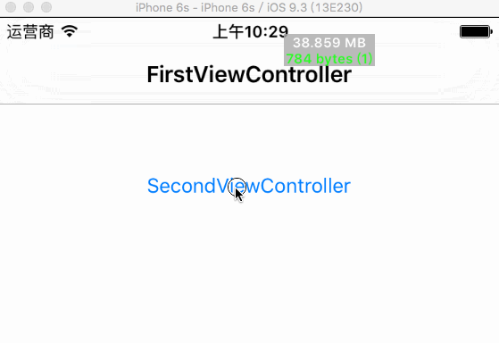

# ZJMemoryProfiler

An memory tool for easy browsing viewControllers in memory over time, using [FBMemoryProfiler](https://github.com/facebook/FBMemoryProfiler) and [FBAllocationTracker](https://github.com/facebook/FBAllocationTracker) and [FBRetainCycleDetector](https://github.com/facebook/FBRetainCycleDetector).

## About

It also can detect retain cycles of viewControllers.

Here is a small demo



## Installation

### CocoaPods

To your podspec add:

    pod 'ZJMemoryProfiler'

## Usage

To start using `ZJMemoryProfiler` you'll first need to enable `FBAllocationTracker`.

```objc
#import <FBAllocationTracker/FBAllocationTrackerManager.h>

int main(int argc, char * argv[]) {
  [[FBAllocationTrackerManager sharedManager] startTrackingAllocations];
  [[FBAllocationTrackerManager sharedManager] enableGenerations];
  @autoreleasepool {
      return UIApplicationMain(argc, argv, nil, NSStringFromClass([AppDelegate class]));
  }
}
```

To enable memory profiler:

```objc
#import <ZJMemoryProfiler/ZJMemoryProfiler.h>

ZJMemoryProfiler *memoryProfiler = [ZJMemoryProfiler sharedProfiler];
[memoryProfiler enable];

// Store memory profiler somewhere to extend it's lifetime
_memoryProfiler = memoryProfiler;
```

Add method to get viewControlls witch you want to browse:

```objc
#import <ZJMemoryProfiler/ZJMemoryProfiler.h>

- (void)viewDidAppear:(BOOL)animated {
    [super viewDidAppear:animated];
    [[ZJMemoryProfiler sharedProfiler] updateViewControllerInfo:self];
}
```

`ZJMemoryProfiler` will show up as a view on the screen. Once tapped, it will recheck the memory usage of current viewController. Double tapped, it will open FBMemoryProfiler in full size mode.

We can also define plugins (check below) and [filters for retain cycle detector](https://github.com/facebook/FBRetainCycleDetector#filters), that we pass to configuration.

```objc
#import <FBRetainCycleDetector/FBStandardGraphEdgeFilters.h>

NSArray *filters = @[FBFilterBlockWithObjectIvarRelation([UIView class], @"_subviewCache")];
FBObjectGraphConfiguration *configuration = [[FBObjectGraphConfiguration alloc] initWithFilterBlocks:filters
                                                                                     shouldInspectTimers:NO];
ZJMemoryProfiler *memoryProfiler = [ZJMemoryProfiler sharedProfiler];
memoryProfiler.enableCheckRetainCycles = YES;      // You must enable this fun.
memoryProfiler.fbPlugins = filters;
memoryProfiler.retainCycleDetectorConfiguration = configuration;
[memoryProfiler enable];
```

We can also add an interval time to check memory automatically.

```objc
memoryProfiler.autoCheckIntervalSeconds = 5;
```

## Thanks
For more details: [FBMemoryProfiler](https://github.com/facebook/FBMemoryProfiler)
